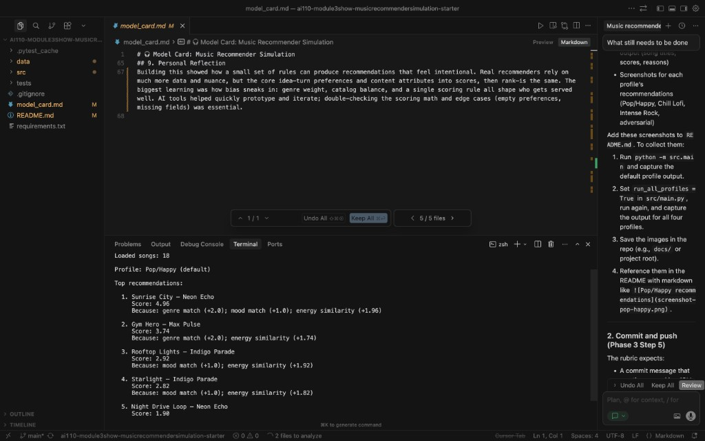
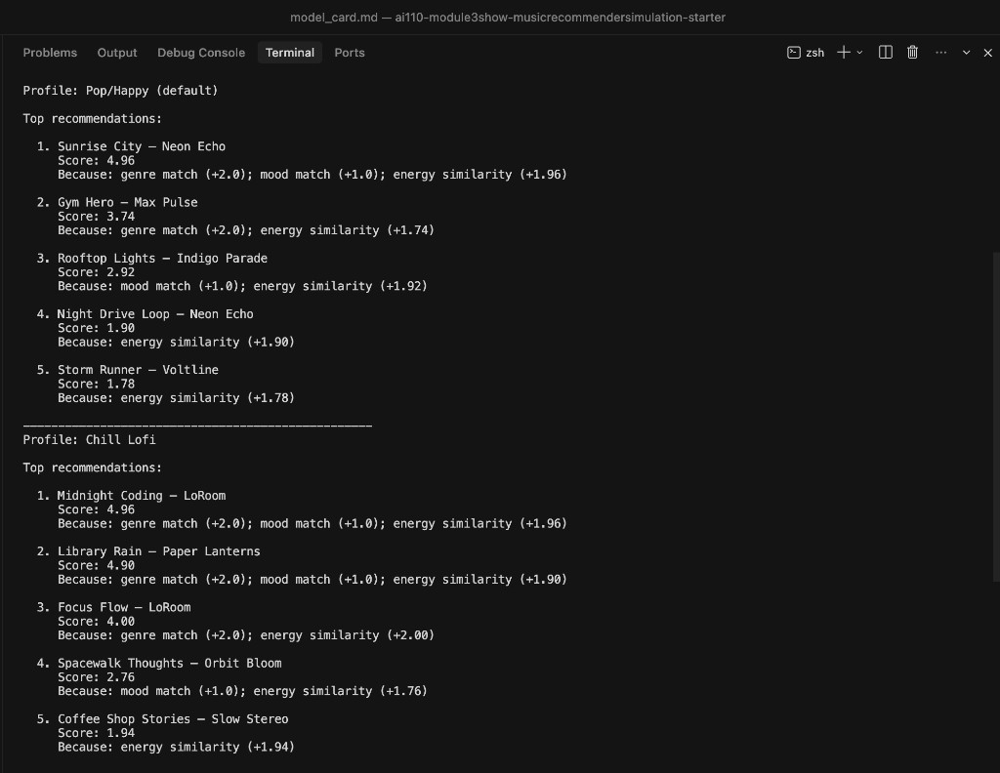
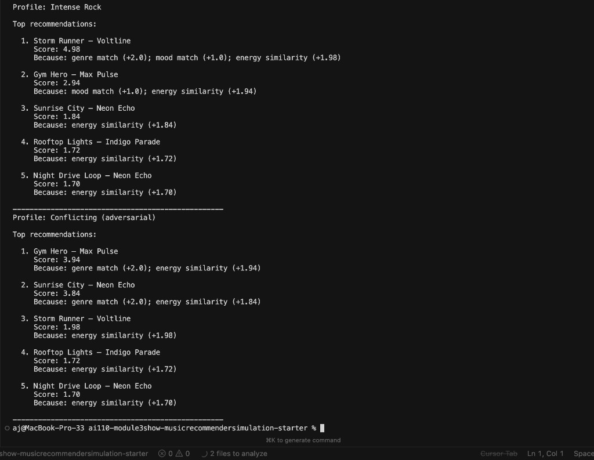

# 🎵 Music Recommender Simulation

## Project Summary

In this project you will build and explain a small music recommender system.

Your goal is to:

- Represent songs and a user "taste profile" as data
- Design a scoring rule that turns that data into recommendations
- Evaluate what your system gets right and wrong
- Reflect on how this mirrors real world AI recommenders

This music recommender is a content-based system that suggests songs from a small catalog by comparing each track's attributes (genre, mood, energy) to a user's taste profile. It scores every song, ranks them, and returns the top suggestions with clear explanations of why each was recommended.

---

## How The System Works

Real-world recommenders (Spotify, YouTube, etc.) match users to content using either collaborative filtering (what similar users liked) or content-based filtering (what attributes the content shares with what you've enjoyed). This simulation uses **content-based filtering**: we define a user's preferences as target values (genre, mood, energy), then judge each song by how closely it matches those targets.

- **Song features used:** `genre`, `mood`, `energy` (plus `tempo_bpm`, `valence`, `danceability`, `acousticness` in the dataset; only genre, mood, energy are used in scoring).
- **UserProfile stores:** `favorite_genre`, `favorite_mood`, `target_energy`, `likes_acoustic`.
- **Scoring:** +2.0 for genre match, +1.0 for mood match, up to 2.0 for energy similarity (`2 * (1 - |song_energy - target_energy|)`).
- **Ranking:** Sort all songs by score descending, return top K with explanations.

---

## Getting Started

### Setup

1. Create a virtual environment (optional but recommended):

   ```bash
   python -m venv .venv
   source .venv/bin/activate      # Mac or Linux
   .venv\Scripts\activate         # Windows
   ```

2. Install dependencies:

   ```bash
   pip install -r requirements.txt
   ```

3. Run the app:

   ```bash
   python -m src.main
   ```

**Sample output (Pop/Happy profile):**



### Running Tests

Run the starter tests with:

```bash
pytest
```

You can add more tests in `tests/test_recommender.py`.

---

## Experiments You Tried

- **Weight shift:** Doubling energy and halving genre made Rooftop Lights (indie pop, happy) beat Gym Hero for Pop/Happy users—mood/energy mattered more than strict genre.
- **Diverse profiles:** Pop/Happy ranks Sunrise City first; Chill Lofi ranks Midnight Coding and Library Rain; Intense Rock ranks Storm Runner; adversarial (pop + sad + high energy) surfaces Gym Hero and Sunrise City (genre + energy matches).
- **Stress test:** Ran all four profiles; results align with expectations for coherent profiles; adversarial profile reveals scoring tradeoffs.

**Stress test output (Pop/Happy and Chill Lofi profiles):**



**Stress test output (Intense Rock and Conflicting/adversarial profiles):**



---

## Limitations and Risks

- Small catalog (10 songs)—limited variety.
- No lyrics or semantic understanding; recommendations are purely attribute-based.
- Genre weight (2.0) can dominate; mood and energy may be overshadowed.
- May over-favor pop and lofi because they appear more often in the dataset.

See [model_card.md](model_card.md) for a fuller discussion.

---

## Reflection

Read and complete `model_card.md`:

[**Model Card**](model_card.md)

Building this recommender shows how simple rules (genre match, mood match, energy closeness) can produce recommendations that feel intentional. Real systems use much more data—listening history, social signals, A/B tests—but the core idea is the same: turn preferences and content attributes into numbers, then rank. Bias shows up when weights favor certain attributes (e.g., genre over mood), when the catalog over-represents some styles, or when a single scoring rule cannot capture diverse tastes. Transparency (returning "reasons" for each suggestion) helps users understand and critique the system.


---

## Model Card

See [**model_card.md**](model_card.md) for the full Model Card.

